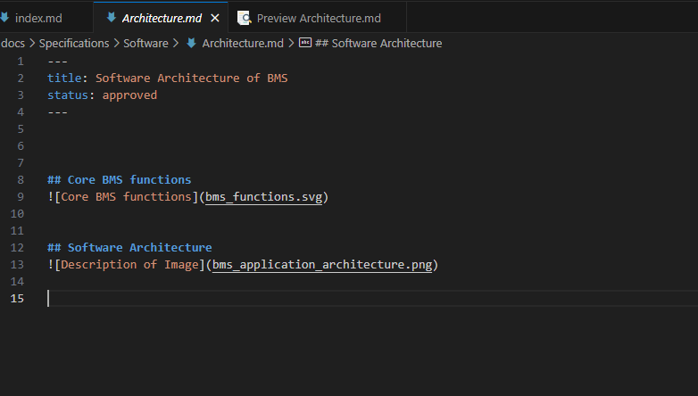
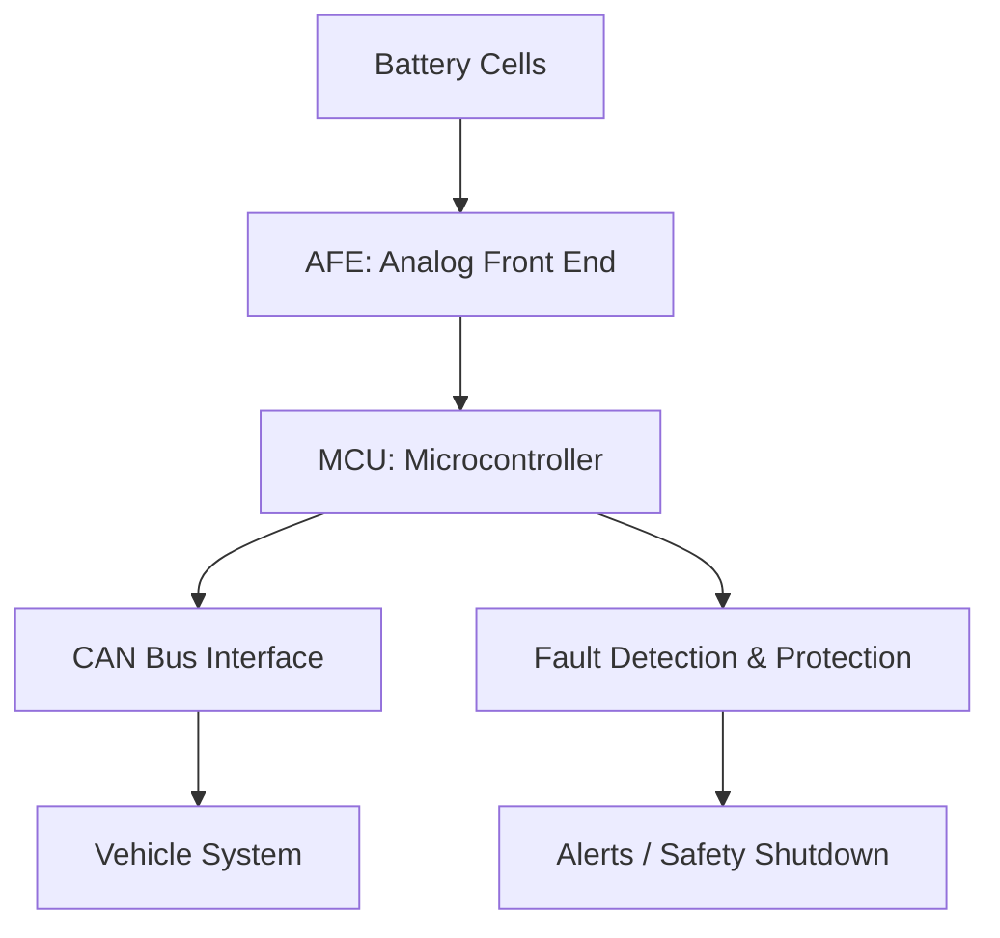
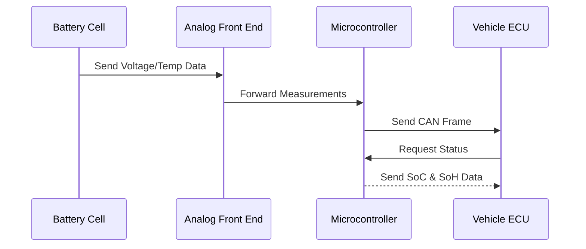
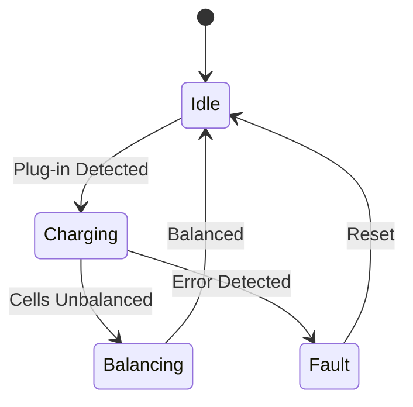
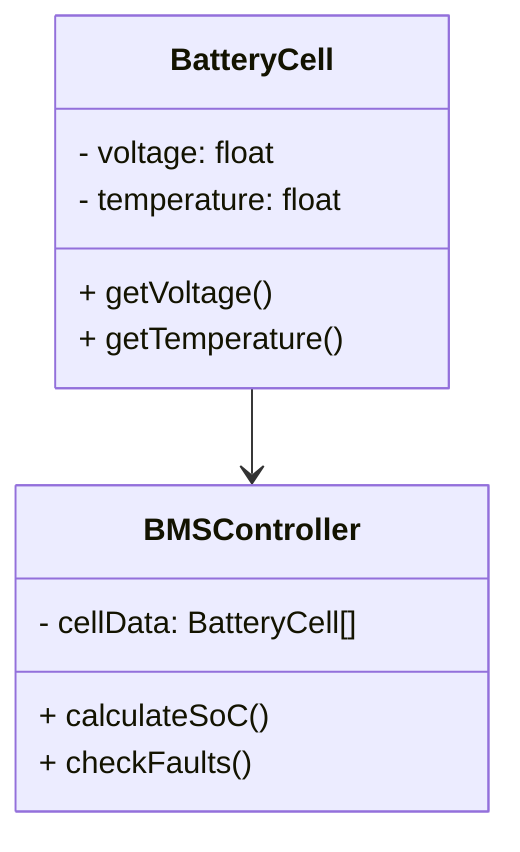
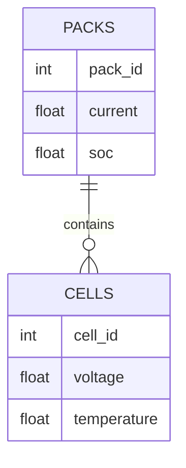
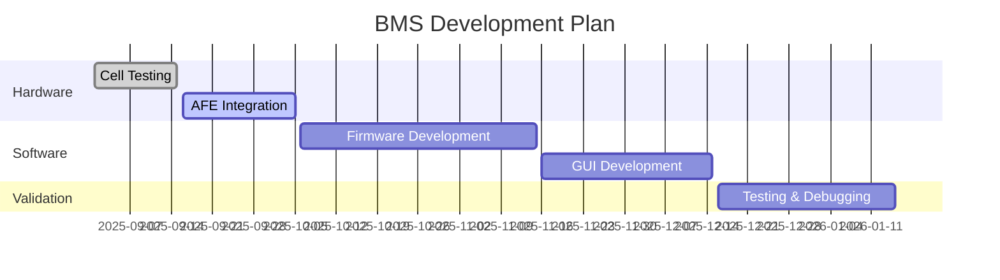

# Welcome to BMS Documentation


This site contains complete documentation for the **Battery Management System (BMS)** project.

---

✨ Start exploring to learn about the **BMS architecture, workflows, setup, and usage guidelines**.


---
 

## MkDocs Project Setup and Documentation Guide

  

## Quick Start: Run Development Environment and MkDocs Server

  

1.  **Activate the Development Environment**:

Run the development environment file click the DevEnvironment file:

```cmd

DevEnvironment

```

2.  **Start the MkDocs Server**

```cmd

mkdocs serve

```

  

(or)

  
  
  

##  Environment Setup

  

Run the setup script to configure your environment cmd/vs code terminal:

  

```cmd

setup.bat

```

  

This script will:

- Configure the Python environment

- Set up virtual environment paths

- Configure necessary environment variables

  

## Install Dependencies

  

Install the required Python packages:

  

```cmd

pip install -r requirements.txt

```

  

This will install:

-  `MkDocs` (>=1.6.1)

-  `MkDocs Material` theme (>=9.5.0)

  

## Serving Documentation Locally

  

To preview the documentation locally, run:

  

```cmd

mkdocs serve

```

  

Open a web browser and navigate to `http://127.0.0.1:8000` to view your documentation.

  

##  Writing Documentation

  

All documentation files should be placed in the `docs/` directory:

  

```

docs/

├── index.md # Homepage (required)

├── Blog/              # Organized content sections
     └──  Posts/
├── Specifications/    # Organized content sections
     └──  Hardware/
		└──  file.md
     └──  Software/
		└──  file.md


```
 

### Tips for Writing:

- Use Markdown syntax for formatting content.


- Treat each folder as a page, and consider each file within the folder as a topic of that - page.

- Store all images in docs/folder/image.png

- For longer content, create subfolders under sections/ to keep it organized.

  

##  Images

To include an image:

```markdown



```


  
  


## Math / Formulas
```
$$
\int_0^\infty e^{-x} dx = 1
$$
```

$$
\int_0^\infty e^{-x} dx = 1
$$


## Diagram


## 1. Flowchart (System Overview)

Shows high-level flow of signals inside BMS.



---

## 2. Sequence Diagram (Communication Flow)

Shows message passing (e.g., CAN bus or serial communication).



---

## 3. State Diagram (BMS Operating Modes)

Good for showing the **BMS state machine**.



---

## 4. Class Diagram (Software Components)

Useful for showing **C++ / Python classes** in your BMS software.



---

## 5. Entity-Relationship Diagram (Database)

If you’re storing battery data in PostgreSQL / SQLite.



---

## 6. Gantt Chart (Project Timeline)

For planning **development stages**.



---

## 7. VegaLite Charts (Data Visualization)

Interactive charts for displaying BMS data and metrics.

### Battery Voltage Over Time

```vegalite
{
  "$schema": "https://vega.github.io/schema/vega-lite/v5.json",
  "description": "Battery cell voltages over time",
  "width": 600,
  "height": 300,
  "data": {
    "values": [
      {"time": "00:00", "cell_1": 3.2, "cell_2": 3.18, "cell_3": 3.22, "cell_4": 3.19},
      {"time": "01:00", "cell_1": 3.25, "cell_2": 3.21, "cell_3": 3.26, "cell_4": 3.23},
      {"time": "02:00", "cell_1": 3.3, "cell_2": 3.28, "cell_3": 3.31, "cell_4": 3.29},
      {"time": "03:00", "cell_1": 3.4, "cell_2": 3.38, "cell_3": 3.42, "cell_4": 3.39},
      {"time": "04:00", "cell_1": 3.5, "cell_2": 3.48, "cell_3": 3.52, "cell_4": 3.49}
    ]
  },
  "transform": [
    {
      "fold": ["cell_1", "cell_2", "cell_3", "cell_4"],
      "as": ["cell", "voltage"]
    }
  ],
  "mark": {
    "type": "line",
    "point": true,
    "tooltip": true
  },
  "encoding": {
    "x": {
      "field": "time",
      "type": "ordinal",
      "title": "Time"
    },
    "y": {
      "field": "voltage",
      "type": "quantitative",
      "title": "Voltage (V)",
      "scale": {"domain": [3.1, 3.6]}
    },
    "color": {
      "field": "cell",
      "type": "nominal",
      "title": "Battery Cell",
      "scale": {"scheme": "category10"}
    }
  }
}
```

### State of Charge Distribution

```vegalite
{
  "$schema": "https://vega.github.io/schema/vega-lite/v5.json",
  "description": "Battery State of Charge distribution",
  "width": 400,
  "height": 300,
  "data": {
    "values": [
      {"range": "0-20%", "count": 2},
      {"range": "21-40%", "count": 5},
      {"range": "41-60%", "count": 8},
      {"range": "61-80%", "count": 12},
      {"range": "81-100%", "count": 15}
    ]
  },
  "mark": {
    "type": "bar",
    "tooltip": true,
    "color": "steelblue"
  },
  "encoding": {
    "x": {
      "field": "range",
      "type": "ordinal",
      "title": "SoC Range",
      "sort": null
    },
    "y": {
      "field": "count",
      "type": "quantitative",
      "title": "Number of Batteries"
    }
  }
}
```

---

✨ With these diagrams, you can document:

* **System architecture** → Flowchart
* **Communication** → Sequence diagram
* **Modes** → State diagram
* **Software design** → Class diagram
* **Database** → ER diagram
* **Project plan** → Gantt chart
* **Data visualization** → VegaLite charts

---


!!! note "Tip"

This is a tip block to highlight important information.

  

!!! warning "Caution"

Be careful with this step!

  

!!! info "Tip"

This is a tip block to highlight important information.

  

!!! danger "Tip"

This is a tip block to highlight important information.

  

!!! success "Tip"

This is a tip block to highlight important information.

  

!!! question "Tip"

This is a tip block to highlight important information.

  
  

## ToDo/Checkbox

- [x] Requirement 1

- [ ] Requirement 2
